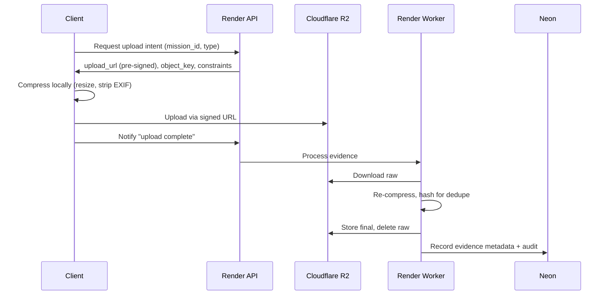
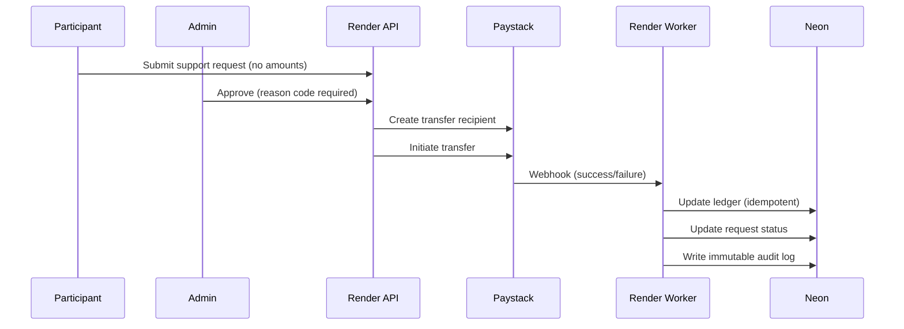

# Infrastructure Architecture

**Module:** System Architecture, Deployment & Integration  
**Applies to:** Cycle28 × Project 3:10 / Impact OS  
**Status:** Canonical Technical Documentation  
**Related:** [Support Wallet](./SUPPORT_WALLET.md), [Partner Funding](./PARTNER_FUNDING.md)

---

## 1. Stack Overview

| Layer | Service | Purpose |
|-------|---------|---------|
| **Frontend** | Vercel (Next.js) | All user interfaces |
| **Backend** | Render | API + Workers + Cron |
| **Database** | Neon (Postgres) | Truth layer |
| **Storage** | Cloudflare R2 | Evidence files |

---

## 2. Service Responsibilities

### Vercel (Frontend)

Hosts all user interfaces:
- Participant app (missions, check-ins, support requests)
- Mentor UI (escalations)
- Admin UI (cohorts, stipends, verification, partner ops)
- Partner UI (funding + reports)

**Rules:**
- Uses Render API for all data
- Never handles heavy processing
- Fast deploy + preview URLs

---

### Render (Backend)

**Single Service Architecture** (Free Tier Compatible)

One NestJS service handles all backend responsibilities:

```
┌─────────────────────────────────────────────────┐
│               Render Service                     │
├─────────────────────────────────────────────────┤
│  API Endpoints        │  Background Queue        │
│  ─────────────────    │  ─────────────────       │
│  • Auth / RBAC        │  • Evidence processing   │
│  • Missions           │  • Webhook handling      │
│  • Support requests   │  • Notifications         │
│  • Partner ops        │  • Report generation     │
│  • Upload intents     │                          │
├─────────────────────────────────────────────────┤
│  Internal Cron (@nestjs/schedule)               │
│  ─────────────────────────────────────────────  │
│  • Daily inactivity check                       │
│  • Weekly summaries                             │
│  • End-of-cohort reports                        │
└─────────────────────────────────────────────────┘
```

#### Implementation Pattern

**1. Background Queue (Bull + In-Memory)**

For free tier, use Bull with in-memory adapter (no Redis required):

```typescript
// app.module.ts
@Module({
  imports: [
    BullModule.forRoot({
      // In-memory mode for free tier
      // Switch to Redis URL for production
    }),
    BullModule.registerQueue(
      { name: 'evidence' },
      { name: 'webhooks' },
      { name: 'notifications' },
    ),
  ],
})
```

**2. Cron Jobs (NestJS Schedule)**

```typescript
@Injectable()
export class CronService {
  @Cron('0 0 * * *') // Daily at midnight
  async checkInactivity() { /* pause inactive participants */ }

  @Cron('0 9 * * 1') // Weekly Monday 9am
  async weeklyDigest() { /* generate admin summaries */ }
}
```

#### Free Tier Limitations

| Limitation | Mitigation |
|------------|------------|
| Service sleeps after 15min | cron-job.org ping every 14min |
| No Redis | In-memory Bull queue |
| 512MB RAM | Efficient batch processing |
| Webhooks fail if sleeping | Accept retry + idempotency |

#### Scale Path (When Ready)

```
Free Tier (1 service)  →  Pro Tier (3 services)
─────────────────────     ───────────────────────
Single process            API + Worker + Cron
In-memory queue           Redis queue
cron-job.org              Dedicated cron service
```

---

### Neon (Database)

Holds the truth layer:
- Participants, cohorts, roles
- Missions, attempts, failures
- Wallet ledger (internal)
- Support requests + approvals
- Evidence metadata (not files)
- Paystack transfer ledger + webhook events
- Partner commitments + allocations
- Reports (versioned)

**Why Neon:** Postgres + branching for environments.

---

### Cloudflare R2 (Storage)

Stores only:
- Compressed evidence images (final artifacts)
- Generated PDFs for reports (admin/partner downloads)

**Rules:**
- Private bucket
- Signed URLs only
- Retention policies (auto-delete low-value evidence)

---

## 3. Evidence Upload Flow



### Why This Pattern
- Keeps Vercel out of storage
- Reduces Render bandwidth
- Preserves audit trail
- Enables deduplication

---

## 4. Paystack Transfer Flow

### Audit Requirements

Every transfer must reference:
- `support_request_id`
- `mission_id`
- `cohort_id`
- `participant_id`
- `approval_id`
- `budget_ledger_entry_id`

### Flow



---

## 5. Budget Tracking

### Per-Participant Wallet

| Field | Visibility |
|-------|------------|
| `allocated_budget` (MSA) | Admin only |
| `spent_total` | Admin only |
| `remaining_balance` | Admin only |
| `category_spend` | Admin only |

### End-of-Cohort Reporting

**Admin version (numeric):**
- Exact amounts per category
- Remaining balance
- Support efficiency metrics

**Participant version (qualitative):**
- "Support accessed: Data / Transport / Tools"
- "Eligibility maintained"
- "Support not required after Week 3"
- **No numbers shown**

---

## 6. Core API Endpoints

### Auth / RBAC
```
POST /auth/login
GET  /me              → returns roles + routing
```

### Upload Intents
```
POST /evidence/intents
POST /evidence/complete
```

### Support Requests
```
POST /support/requests
POST /support/requests/:id/approve
POST /support/requests/:id/deny
```

### Webhooks
```
POST /webhooks/paystack
```

---

## 7. Operational Cautions

### A. Render Free Tier Sleeps

Webhooks fail when service sleeps.

**Mitigations:**
- Use paid tier for webhook service
- Lightweight uptime monitor (ping)
- cron-job.org keep-alive

### B. Idempotency Requirements

Must be idempotent:
- Evidence completion calls
- Paystack webhooks
- Transfer initiation retries

**Pattern:** Store `idempotency_key` with each operation.

### C. R2 Security

- Never expose raw keys
- Always use signed URLs
- Short expiration times
- Log all access

---

## 8. Environment Configuration

### Required Environment Variables

#### API Service
```env
DATABASE_URL=         # Neon connection string
PAYSTACK_SECRET_KEY=  # Paystack API key
R2_ACCESS_KEY_ID=     # Cloudflare R2 credentials
R2_SECRET_ACCESS_KEY=
R2_BUCKET_NAME=
R2_ENDPOINT=
JWT_SECRET=
RESEND_API_KEY=       # Email service
```

#### Worker Service
```env
DATABASE_URL=
R2_ACCESS_KEY_ID=
R2_SECRET_ACCESS_KEY=
R2_BUCKET_NAME=
PAYSTACK_WEBHOOK_SECRET=
```

#### Cron Service
```env
DATABASE_URL=
INTERNAL_API_URL=     # To trigger API endpoints
```

---

## 9. Deployment Strategy

### Development
- Neon branch per feature
- Vercel preview per PR
- Render: single dev service

### Staging
- Neon staging branch
- Vercel staging deployment
- Render: full 3-service setup

### Production
- Neon main branch
- Vercel production
- Render: 3 services with paid tier

---

## 10. Monitoring & Alerting

### Key Metrics
| Metric | Alert Threshold |
|--------|-----------------|
| API response time | >500ms |
| Worker queue depth | >100 items |
| Cron job failures | Any |
| Paystack webhook errors | Any |
| Evidence upload failures | >5% |

### Logging
- Structured JSON logs
- Correlation IDs across services
- PII redaction in logs

---

*This documentation supports deployment, operations, and infrastructure decisions.*
