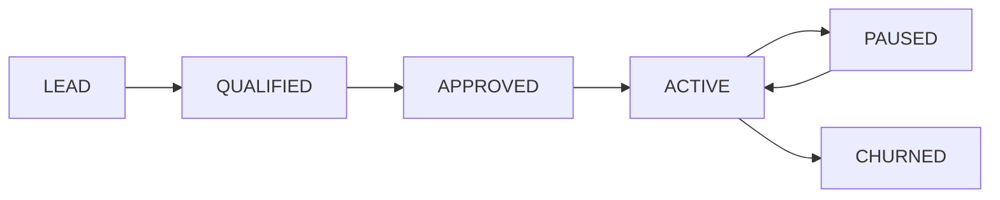
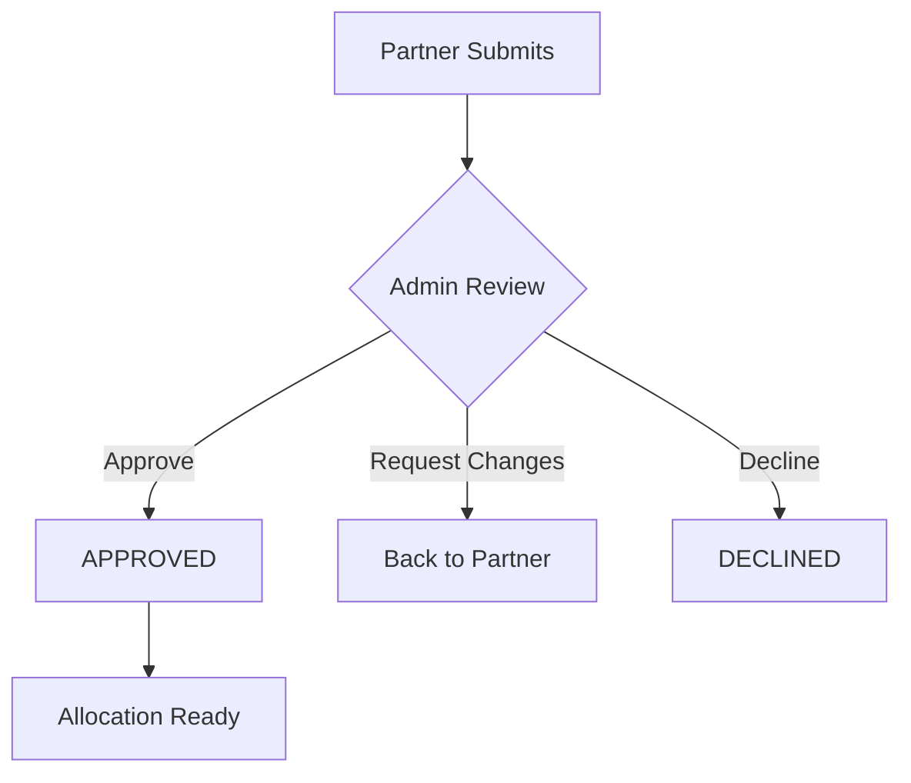

# Partner Funding System

**Module:** Partner Management, Funding Commitments & Allocation  
**Applies to:** Cycle28 × Project 3:10 / Impact OS  
**Status:** Canonical Operational Documentation  
**Related:** [Core Governance](./IMPACT_OS_GOVERNANCE.md), [Support Wallet](./SUPPORT_WALLET.md)

---

## 1. Purpose & Philosophy

The Partner Funding System exists to **receive and allocate external capital** without compromising system integrity or creating favoritism.

### Core Principles

* Partners fund **systems**, not individual people
* Commitments fuel **cohorts**, not preferences
* Admins **operate**, system **enforces**
* Dashboards **build trust**, not interference

> **System Law:** All funding is traceable. All allocation is auditable.

---

## 2. Partner Lifecycle

### Stage 1: Lead (Pre-Approval)

After enquiry submission:
```
Status: LEAD
```

Captured fields:
- Organization name
- Contact person + email
- Interest type (recurring / one-off / unsure)
- Estimated amount range
- Motivation (CSR, NGO, pilot)

Location: **Admin > Partner Pipeline**

### Stage 2: Qualification

Admin reviews and sets:
- `PartnerStatus = QUALIFIED | HOLD | DECLINED`
- Internal notes
- Risk/compliance flags

### Stage 3: Approval

Once approved:
- Status → `APPROVED`
- Partner can create login
- Routed to `/partner` portal

### Stage 4: Active Funding

When first commitment becomes active:
- Status → `ACTIVE`
- Appears in active partners list



---

## 3. Funding Commitments

### The Core Abstraction

A **Commitment** is a promise of capital under defined rules.

> [!IMPORTANT]
> Do NOT think in terms of "monthly partners" vs "one-off partners". Use Commitments as the unified model.

### Commitment Types

| Type | Meaning | Example |
|------|---------|---------|
| `RECURRING` | Fixed amount, regular cadence | $500/month |
| `ONE_OFF` | Single contribution | $5,000 once |
| `COHORT_SPONSOR` | Funds specific cohort | 25 participants |
| `CAPACITY_POOL` | Funds up to X participants | Up to 50 seats |
| `PLEDGE_PENDING` | Approved but unfunded | Awaiting transfer |

### Commitment Parameters

#### Recurring
- Amount per cycle
- Cadence (monthly/quarterly/annual)
- Start date
- End date (or open-ended)

#### One-Off
- Total amount
- Intended use (next cohort / general pool)

#### Cohort Sponsor
- Cohort size
- Target region (optional)
- Timing preference

System calculates: `estimated_cost = cohort_size × cost_per_participant`

---

## 4. Commitment Approval Flow



### Status Transitions

| From | To | Trigger |
|------|----|---------|
| SUBMITTED | APPROVED | Admin approval |
| APPROVED | ACTIVE | First allocation released |
| ACTIVE | COMPLETED | Fully utilized |
| ACTIVE | PAUSED | Partner/admin pause |
| PAUSED | ACTIVE | Resume |

---

## 5. Allocation Engine

### How Funds Flow

```
Commitment → Allocation → Cohort → Participants
```

### Allocation Rules

1. **No over-allocation**: Total allocations ≤ commitment amount
2. **Logged changes only**: No silent edits
3. **Tranche releases**: Recurring funds released per cycle
4. **Cohort assignment**: Admin assigns, system enforces

### Admin Actions

| Action | Requirement |
|--------|-------------|
| Assign to cohort | Commitment must be APPROVED |
| Release funds | Allocation must be PLANNED |
| Pause allocation | Must log reason |
| Adjust amount | Creates new ledger entry |

---

## 6. Partner Dashboard

Partners see **only their commitments**. No operational controls.

### Sections

#### A. Overview
- Total funded (all time)
- Participants supported
- Earners produced
- Cost per earner

#### B. My Commitments
For each:
- Type (Recurring, One-Off, etc.)
- Amount
- Status
- Linked cohort(s)
- Utilization %

#### C. Funding History
Ledger-style view:
- Date
- Amount
- Commitment reference
- Status
- Download receipt

#### D. Reports
- Interim cohort reports (read-only)
- Final cohort reports (locked)
- Annual impact summary

### Visibility Rules

| Data | Partner Sees |
|------|--------------|
| Commitment status | ✅ Yes |
| Allocation status | ✅ Yes |
| Individual participants | ❌ No |
| Participant wallets | ❌ No |
| Other partners | ❌ No |

---

## 7. Admin Operations View

### Partner Pipeline

Each partner card shows:
- Partner name
- Status (Lead / Qualified / Approved / Active)
- Total committed
- Total disbursed
- Active commitments count

### Commitments Table

For each commitment:
- Type
- Amount + cadence
- Status
- Linked cohorts
- Utilization %

### Admin Actions

| Action | Audit |
|--------|-------|
| Approve commitment | Logged with approver ID |
| Pause commitment | Requires reason |
| Assign to cohort | Creates allocation |
| Add notes | Timestamped |
| Edit amount | **Not allowed** — must cancel and recreate |

---

## 8. Reporting & Impact

### Report Types

| Type | When | Content |
|------|------|---------|
| Cohort Interim | Mid-cohort | Progress, engagement |
| Cohort Final | Post-cohort | Outcomes, earners |
| Annual Impact | Yearly | Aggregate impact |
| Custom | On request | Specific metrics |

### Partner Report Contents

**Transformation Overview:**
- Identity progression (L0 → Lx)
- Skill triad balance
- Time-to-first-income

**Funding Utilization:**
- Participants supported
- Support types used
- Earners produced
- Cost per earner

**Behavioral Signals:**
- Action rates
- Arena exposure
- Conversion rates

---

## 9. Audit Trail

Every funding event generates an immutable log.

### Ledger Entry Fields

| Field | Description |
|-------|-------------|
| `commitment_id` | Which commitment |
| `type` | CREATED, RELEASED, DISBURSED, ADJUSTED |
| `amount` | Transaction amount |
| `cohort_id` | Linked cohort (if any) |
| `description` | Human-readable note |
| `created_by_id` | Admin or SYSTEM |
| `created_at` | Timestamp |

> **System Law:** No deletion. Only superseding records.

---

## 10. Integration Points

### With Support Wallet

When participant support is disbursed:
1. Debit from `SupportWallet`
2. Credit to `FundingLedger` (if commitment-funded)
3. Track cost-per-participant

### With Cohort System

- Allocations link to Cohort
- Cohort cost calculated from allocations
- Impact reports aggregate per cohort

### With Intake System

- Cohort capacity set by allocations
- Over-subscription triggers waitlist
- Stipend eligibility tied to funded slots

---

## 11. System Laws

> Partners fund systems, not people.  
> Commitments are the core abstraction.  
> Every allocation must be logged.  
> Every disbursement must be traceable.  
> Dashboards show impact, not operations.

---

## 12. Technical Reference

### API Endpoints

| Endpoint | Method | Description |
|----------|--------|-------------|
| `/partners` | GET | List partners (admin) |
| `/partners/:id` | GET | Partner detail |
| `/partners/:id/commitments` | GET | Partner's commitments |
| `/commitments` | POST | Create commitment |
| `/commitments/:id` | GET | Commitment detail |
| `/commitments/:id/allocate` | POST | Assign to cohort |
| `/partner/me` | GET | Partner portal overview |
| `/partner/me/reports` | GET | Partner's reports |

### Related Prisma Models

See [schema.prisma](../impact-os-backend/prisma/schema.prisma):
- `Partner`
- `PartnerUser`
- `FundingCommitment`
- `CommitmentAllocation`
- `FundingLedger`
- `PartnerReport`

---

*This documentation supports partner onboarding, admin operations, funding allocation, and funder reporting.*
